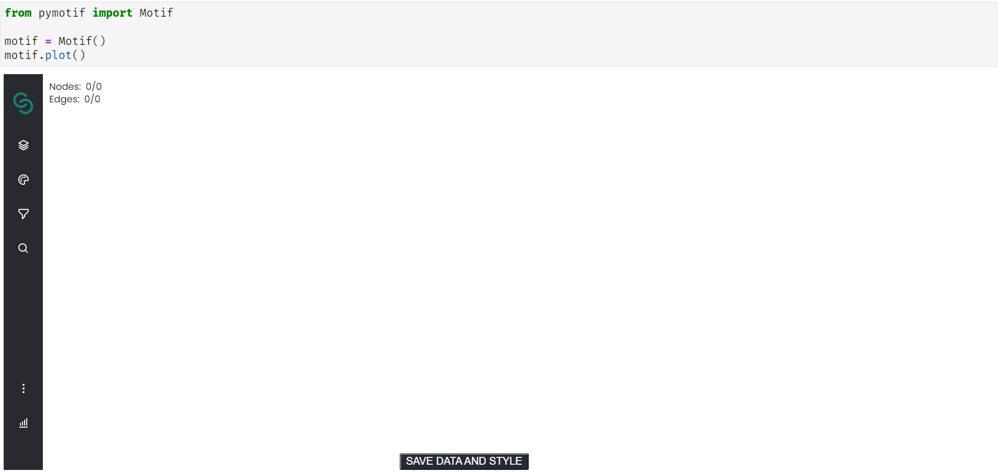

# Pymotif

A Python package that lets you plot Motif graphs within Jupyter Notebook / Jupyter Lab:



It's that easy to get started!

## Advantages

- Seamless integration into existing Jupyter workflows
- Multiple data import options
- Programmatic graph manipulation
- Easy code sharing and reuse

## Installation

You can install using `pip` (we recommend using virtual environments):

```
pip install pymotif
```

And it should work. In some cases, you may also need to install and enable Jupyter extensions:

```
# Jupyter Lab
jupyter labextension install @jupyter-widgets/jupyterlab-manager

# For Jupyter Lab <= 2, you may need to install the extension manually
jupyter labextension install @cylynx/pymotif

# For Jupyter Notebook <= 5.2, you may need to enable nbextensions
jupyter nbextension enable --py [--sys-prefix|--user|--system] pymotif
```

## Examples

Demo notebooks can be found in the `examples` folder. For a start, check out `examples/introduction.ipynb`, which gives a quick overview of the available functionality!

## Motif Class (TODO)

As shown above, using `pymotif` involves importing and instantiating the `Motif` class. Its attributes and methods are described below:

#### Instantiation

#### Attributes

#### Methods

---

## Development

For a more thorough walkthrough check out the official guide:  
https://ipywidgets.readthedocs.io/en/latest/examples/Widget%20Custom.html

### Create a new conda environment with the dependencies

To create the environment, execute the following command:

```
conda create -n motif -c conda-forge jupyterlab nodejs python
```

Then activate the environment with:

```
conda activate motif
```

### Build and install the widget for development

Since the widget contains a Python part, you need to install the package in editable mode:

```
npm run pymotif:build // In root directory to link it with monorepo setup
python -m pip install -e .
```

Install required Python packages:

```
python -m pip install -r requirements.txt
```

If you are using JupyterLab:

```
jupyter labextension develop --overwrite .
```

If you are using the Classic Notebook:

```
jupyter nbextension install --sys-prefix --symlink --overwrite --py pymotif
jupyter nbextension enable --sys-prefix --py pymotif
```

To continuously monitor the project for changes and automatically trigger a rebuild, start Jupyter in watch mode:

```
jupyter lab --watch
```

And in a separate session, begin watching the source directory for changes:

```
npm run pymotif  // In root directory to link it with monorepo setup
```

After a change wait for the build to finish and then refresh your browser and the changes should take effect.

If you make a change to the python code then you will need to restart the notebook kernel to have it take effect.

### Publishing

1. Update the version in package.json
2. Relase the `@cylynx/pymotif` packages:

```
npm login
npm run pymotif:publish
```

3. Bundle the python package: `python setup.py sdist bdist_wheel`
4. Update the version in `pymotif/_version.py`
5. If frontend version dependency has changed, update `pymotif/_frontend.py`
6. Publish the package to PyPI:

```
pip install twine
twine upload dist/pymotif*
```
